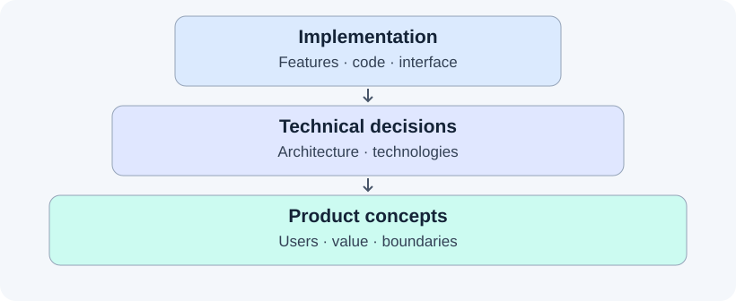
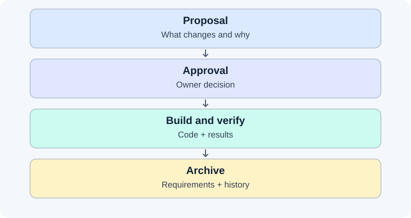
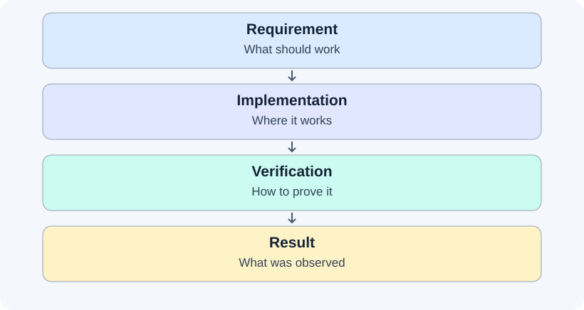
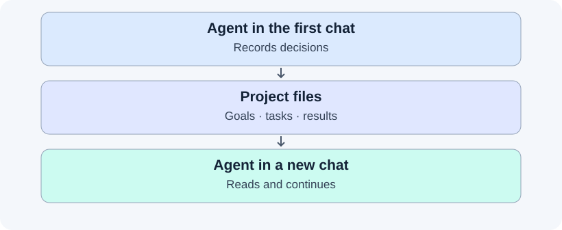
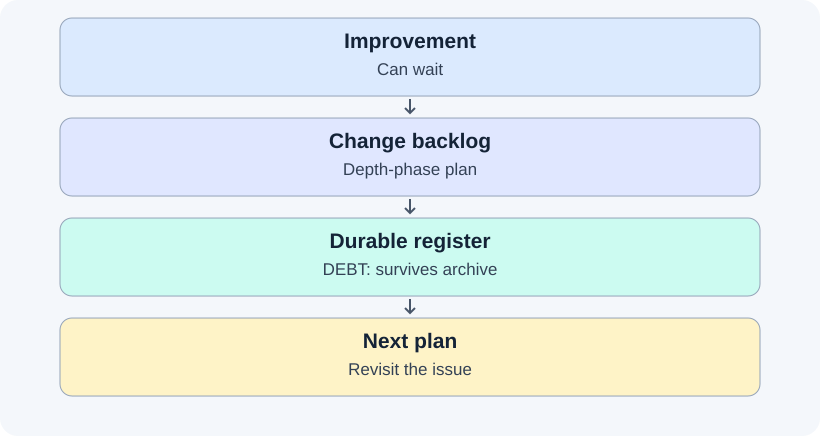
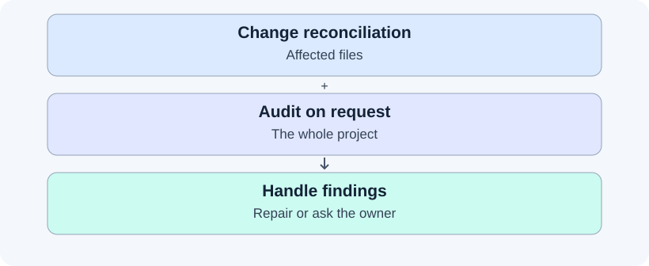
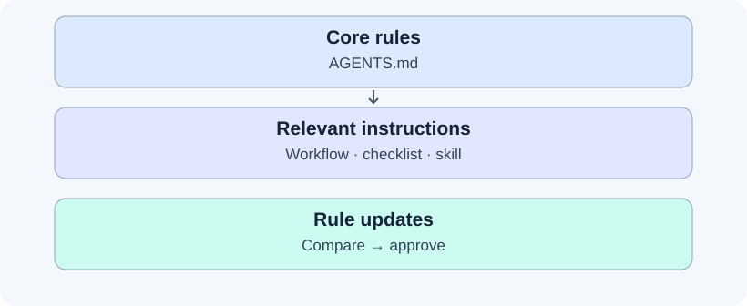

# Workframe

[Русский](README.md)

Has your AI agent ever started coding before understanding the task? Forgotten earlier decisions in a new chat? Said “done” without checking the scenario you needed? Or put a bug on a “fix later” list and never returned to it?

**Workframe helps bring order to development with AI.** It is a package of rules, instructions, and templates you add to your project. It gives the agent a working process: understand the task, agree on a solution, implement it, verify it, and record the outcome.

| Before | With Workframe |
| --- | --- |
| The agent jumps straight into code | It clarifies the task and proposes a plan |
| Decisions stay in chat | Agreements live alongside the code |
| A new chat starts almost from scratch | The agent reads the goals, plan, and recorded decisions |
| “Done” means “code written” | Completion requires verification results |
| Bugs and improvements disappear | A backlog and durable register keep them visible |
| Code and documentation drift apart | Changes end with reconciliation; a separate audit checks the project |

Workframe works with new and existing projects. You describe the task in ordinary language, make product decisions, and authorize important actions. The agent follows instructions stored in the repository. Compliance depends on the model and client: Workframe makes work easier to inspect, but cannot guarantee an error-free agent.

## 1. Design: from purpose to code

### The idea

Development involves three different questions: why the product exists, how it should be built, and what to implement now. Implementation should follow technical decisions, which should follow the product's goals.



Suppose a notes app must work offline. That is a product decision. It leads to a technical choice: store notes on the device. Only then comes the code that saves a note. Saving exclusively through a server would violate the original goal, even if that code ran without errors.

### In Workframe

- `docs/CONCEPTS.md` holds the purpose, audience, value, principles, and boundaries. The agent helps define them, records them after confirmation, and reads them before substantial changes. It cannot rewrite the goals on its own.
- An OpenSpec change's `design.md` records technical decisions: the structure of the solution, technologies, and trade-offs.
- Requirements and tasks define the implementation's expected outcome. Project-specific rules live in `docs/PROJECT_RULES.md`; verification commands live in `docs/QUALITY.md`.

These are layers of decision-making, not a rule that code always outranks documents. When code conflicts with requirements and resolving the mismatch means choosing the desired behavior, the agent asks the owner.

## 2. Changes: agree first, then build

### The idea

A substantial task is easier to steer when its intention, implementation, and outcome are visible separately. A plan helps you catch the wrong direction before the agent rewrites half the project.



### In Workframe

The cycle uses **OpenSpec**:

1. **Proposal.** The agent explains what changes and why, and prepares requirements, a technical approach, and tasks.
2. **Apply.** After your approval, it follows the plan and keeps the documents aligned with actual decisions.
3. **Verification.** It runs the relevant checks, records results, and compares the outcome with the requirements.
4. **Archive.** With your authorization, the completed change becomes history and its requirements are merged into the main specifications.

Each substantial change gets its own Git branch. Small typo fixes do not require the full cycle. OpenSpec documents default to Russian, with technical identifiers kept in English.

Large tasks have two phases: first a minimal working system from end to end, then deeper work on individual parts. The agent follows tasks in order and adds extra improvements to the backlog. Defects that block the next step are fixed immediately.

## 3. Verification: what “done” means

### The idea

Written code does not prove a task is solved. Each important requirement needs a check for the behavior actually promised. Rejecting an incorrect password, for example, does not prove that a correct password allows someone to sign in.



### In Workframe

The agent chooses checks for the project's technologies and risks: tests, linters, type checks, builds, and manual scenarios. Commands, triggers, and limitations go into `docs/QUALITY.md`. When a new technology is introduced, the same change revisits this pipeline.

- **Blocking checks** must pass before completion unless the owner explicitly accepts a documented exception.
- **Advisory checks** still require review: the agent confirms an issue, explains a false positive, or records a deferral.
- **Run results** distinguish passed, failed, skipped, and unavailable. A skipped check is not a pass.

A checked task means its declared verification method ran and the result was recorded. If a test fails and then passes, the agent preserves the first failure, investigates it, and reruns the full blocking gate.

Verification depth follows risk. A small edit needs a simple outcome check. Permissions, secrets, external requests, storage, and other sensitive areas require failure and bypass scenarios. Each field of untrusted data used in a decision gets a relevant hostile case; a protective test is also run with its guard removed to show that it detects the missing protection.

Before completion, the agent reviews the requirements, code, and results afresh. High-risk changes use another agent, model, or separate context for independent review. Release or certification work also independently verifies saved evidence and binds it to the exact code revision; merely rereading the diff is insufficient.

## 4. Context: continue in another chat

### The idea

Chat is useful for discussion, but decisions need a durable home. The next agent needs accessible records of the goals, current work, and verification results.



### In Workframe

An incoming agent reads the rules, Git state, and active OpenSpec change before working. Goals live in `docs/CONCEPTS.md`, tasks and decisions in change artifacts, and checks in recorded results and `docs/QUALITY.md`.

You can continue in another client or ask another agent to review the work. Handoffs must be sequential: multiple agents must not edit the same working directory concurrently.

The rules also require preserving your uncommitted changes. Discarding work, rewriting history, merging, publishing, and other consequential actions require the corresponding authorization.

## 5. Backlog: deferred work should stay visible

### The idea

Not every improvement belongs in the current task. But “later” needs an address, and recording a new bug should not turn unfinished work into a completed task.



### In Workframe

Improvements for the current change live in the depth phase of its `tasks.md`. Before archive, unfinished work moves into `docs/DEBT.md`, a durable register of divergences and technical debt. Entries have locations, possible resolutions, and statuses. Before a new proposal, the agent checks relevant open entries and offers to include them.

Regressions introduced by the current change have a separate condition: fix and verify them before acceptance, or obtain an explicit owner decision permitting deferral with documented consequences. A DEBT entry, `accepted` status, future task, or advisory label does not grant that permission on its own.

## 6. Audit: look at the whole project

### The idea

Even careful changes accumulate drift: instructions become outdated, links break, and two documents describe the same thing differently. Checks for one feature do not reveal the entire picture.



### In Workframe

Before proposing archive, the agent reconciles the affected artifacts: requirements, code, verification results, unfinished placeholders, references to removed parts, and deferred work.

At your request, a separate **coherence audit** examines seven areas:

1. Links and paths.
2. Unfinished placeholders.
3. Declared versus actual contents.
4. Code versus specifications.
5. Duplication and contradictions.
6. Potentially unused artifacts.
7. Structure and refactoring needs.

The agent fixes objective mechanical errors. Semantic contradictions and structural issues are recorded for the owner's decision. A file with no incoming references is not automatically safe to delete. History in `openspec/changes/archive/` is never rewritten. Audits scale down for small projects; the first three areas remain required.

## 7. Connecting rules and upgrading

### The idea

Shared working practices should travel between projects while each project keeps its own goals, commands, and constraints. Detailed instructions should be loaded when the agent needs them.



### In Workframe

A compact `AGENTS.md` is the primary instruction file. It specifies when to read a detailed workflow, checklist, or skill, reducing the text loaded for every request. Each shipped instruction file is addressed by another shipped rule.

The common rules work with agents that can read project files. Entry points are provided for **Codex, Claude Code, Cursor, Qwen Code, and Kimi Code**. A model and a client are different things: models follow the same rules through a supported client. For other clients, configure `AGENTS.md` loading and access to `.agents/skills/` if skills are supported.

Optional modules:

- `design-pencil` — design artifacts and Pencil workflows. Editing `.pen` files requires an available Pencil MCP; otherwise the agent uses exports and written decisions.
- `frontend-quality` — additional interface quality checks.

The version and installed modules are recorded in `.project-workframe-version`. An upgrade check compares actual files against templates: equal, changed, or missing, and which release the contents match. Upgrades are separate approved changes. Shared canonical files are copied whole, while project-owned documents and rules are preserved.

## Start a new project

You need Git, Bash, and an agent environment with the OpenSpec CLI for the change cycle. The installer copies Workframe files; the CLI and project verification tools are installed separately in your environment.

From a local Workframe checkout, run:

```bash
mkdir /path/to/my-project
git init /path/to/my-project

/path/to/workframe/scripts/init-project.sh \
  --target /path/to/my-project
```

Add modules when useful:

```bash
/path/to/workframe/scripts/init-project.sh \
  --target /path/to/my-project \
  --with design-pencil \
  --with frontend-quality
```

The script copies files into an existing directory and may overwrite files with the same names. Review the result and make the initial commit. For an existing project, read the [adoption and upgrade guide](docs/UPGRADING.md) first.

Open the project in your agent client and say:

> I want to build an app for … Do not write code yet. Help me define its users, problem, value, and boundaries.

After the discussion, the agent records confirmed decisions and offers to prepare the first OpenSpec change. Review the plan and authorize implementation.

## Upgrade an existing project

First, get a report without changing files:

```bash
/path/to/workframe/scripts/check-workframe-update.sh --target /path/to/project
```

Then ask the agent to prepare `upgrade-workframe-guidance`, review the report, and apply the relevant updates. It should preserve `docs/CONCEPTS.md`, `docs/QUALITY.md`, `docs/DEBT.md`, and `docs/PROJECT_RULES.md`, verify the result, and update the version marker. Details: [docs/UPGRADING.md](docs/UPGRADING.md).

## Repository contents

| Path | Purpose |
| --- | --- |
| `template/base/` | Required files delivered to a project |
| `template/modules/` | Shared skills and optional modules |
| `source/` | Neutral source rules and client notes |
| `examples/` | Adaptation examples; not copied automatically |
| `scripts/` | Installation, version comparison, and Workframe checks |
| `docs/` | Workframe's own documentation |
| `openspec/` | Workframe requirements and development history |

In a generated project, the main entry points are `AGENTS.md`, `docs/AGENT_WORKFLOW.md`, project documents, and `docs/checklists/`. Shared skills live in `.agents/skills/`, with client adapters in `.codex/skills/`, `.claude/skills/`, and `.qwen/skills/`; `CLAUDE.md` routes Claude Code to the common rules.

The current version is in [VERSION](VERSION), with history in [CHANGELOG.md](CHANGELOG.md). Workframe uses SemVer: PATCH for compatible fixes, MINOR for compatible capabilities, and MAJOR for incompatible changes. Releases receive annotated Git tags.
