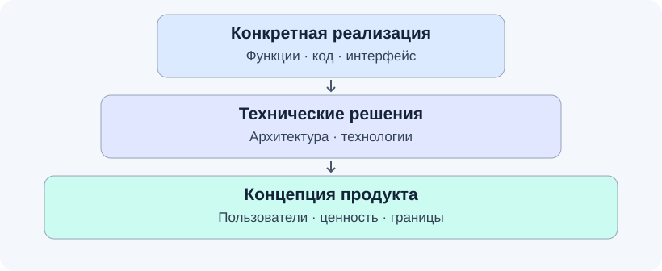
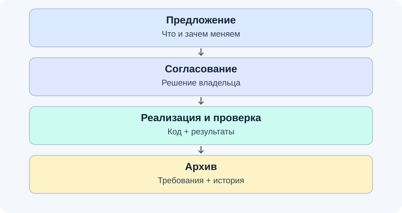
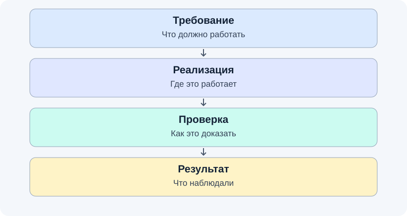
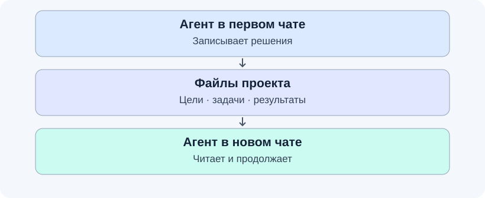
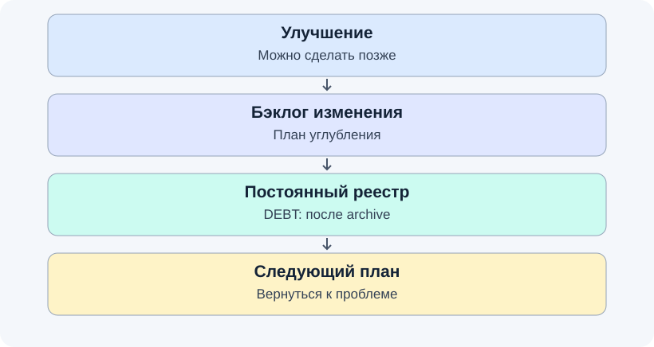
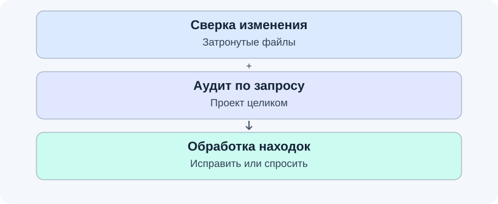
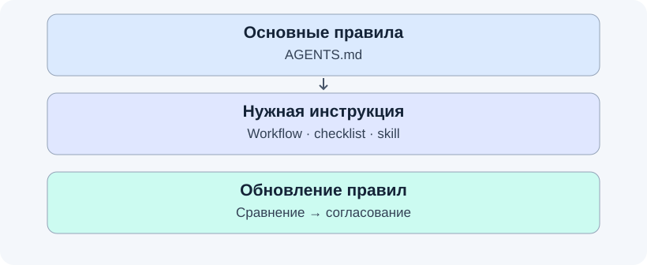

# Workframe

[English](README.en.md)

Бывало, что ИИ-агент начал писать код, не разобравшись в задаче? В новом чате забыл прошлые договорённости? Сказал «готово», хотя нужный сценарий никто не проверил? Или записал ошибку в «исправить потом» — и больше к ней не вернулся?

**Workframe помогает навести порядок в разработке с ИИ.** Это пакет правил, инструкций и шаблонов, который добавляется в ваш проект. Он задаёт агенту порядок работы: разобраться в задаче, согласовать решение, реализовать, проверить и сохранить результат.

| Было | С Workframe |
| --- | --- |
| Агент сразу пишет код | Сначала уточняет задачу и предлагает план |
| Решения остаются в переписке | Договорённости хранятся рядом с кодом |
| Новый чат начинается почти с нуля | Агент читает цели проекта, план и принятые решения |
| «Готово» означает «код написан» | Завершение требует результатов проверок |
| Ошибки и улучшения теряются | Для них есть бэклог и постоянный реестр |
| Код и документация постепенно расходятся | Есть сверка после изменений и аудит проекта |

Workframe подходит для новых и существующих проектов. Вы объясняете задачу обычными словами, принимаете продуктовые решения и разрешаете важные действия. Агент следует правилам, хранящимся в репозитории. Их соблюдение зависит от модели и инструмента: Workframe делает работу проверяемой, но не гарантирует безошибочность ИИ.

## 1. Проектирование: от смысла к коду

### Идея

При разработке приходится отвечать на три разных вопроса: зачем нужен продукт, как он будет устроен и что сделать прямо сейчас. Конкретная реализация должна опираться на технические решения, а те — на цели продукта.



Например, приложение для заметок должно работать без интернета. Это часть концепции. Из неё следует техническое решение: хранить заметки на устройстве. Уже затем появляется конкретный код сохранения. Если агент решит сохранять заметки только через сервер, он нарушит базовую идею, даже если код будет работать без ошибок.

### В Workframe

- `docs/CONCEPTS.md` хранит назначение продукта, пользователей, ценность, принципы и границы. Агент помогает сформулировать их, записывает после подтверждения и читает перед существенными изменениями. Менять цели самостоятельно нельзя.
- Технические решения записываются в `design.md` изменения OpenSpec: устройство решения, выбранные технологии и компромиссы.
- Требования и задачи определяют конкретный результат реализации. Дополнительные правила проекта живут в `docs/PROJECT_RULES.md`, команды проверок — в `docs/QUALITY.md`.

Это уровни принятия решений, а не правило «код всегда важнее документов». Если код расходится с требованиями и нужно выбрать желаемое поведение, агент обращается к владельцу.

## 2. Изменения: сначала договориться, затем сделать

### Идея

Большую задачу проще контролировать, когда замысел, работа и результат видны отдельно. План позволяет заметить неверное направление до того, как агент перепишет половину проекта.



### В Workframe

Цикл организован через **OpenSpec**:

1. **Proposal — предложение.** Агент описывает, что и зачем меняется, готовит требования, технический подход и задачи.
2. **Apply — реализация.** После вашего согласия выполняет план и поддерживает документы в соответствии с принятыми решениями.
3. **Проверка.** Запускает нужные проверки, записывает результаты и сверяет итог с требованиями.
4. **Archive — архив.** По вашему разрешению завершённое изменение уходит в историю, а его требования попадают в основные спецификации.

Каждое существенное изменение получает отдельную ветку Git. Мелкие опечатки не требуют полного цикла. Документы OpenSpec по умолчанию пишутся на русском, технические имена сохраняются на английском.

Для больших задач предусмотрены две фазы: сначала минимальная рабочая система целиком, затем углубление отдельных частей. Агент берёт следующий пункт плана по порядку; дополнительные улучшения складывает в бэклог. Ошибки, мешающие следующему шагу, исправляет сразу.

## 3. Проверки: что означает «готово»

### Идея

Написанный код ещё не доказывает, что задача решена. Для каждого важного требования нужен способ проверить именно обещанное поведение. Например, проверка отказа при неправильном пароле не доказывает, что с правильным паролем можно войти.



### В Workframe

Агент подбирает проверки под технологии и риски проекта: тесты, линтеры, проверку типов, сборку, ручные сценарии. Конкретные команды, условия запуска и ограничения записываются в `docs/QUALITY.md`. При появлении новой технологии этот набор пересматривается в том же изменении.

- **Обязательные проверки** должны пройти до завершения, если владелец явно не принял описанное исключение.
- **Рекомендательные проверки** требуют разбора: агент подтверждает проблему, объясняет ложное срабатывание или фиксирует отсрочку.
- **Результаты запуска** различаются: прошло, упало, пропущено, недоступно. Пропущенная проверка не считается успешной.

Галочка у задачи означает, что заявленный способ проверки выполнен и результат записан. Если тест сначала упал, а потом прошёл, агент сохраняет первое падение, разбирается в причине и повторяет весь обязательный набор.

Глубина проверки зависит от риска. Для маленькой правки достаточно простой проверки результата. Для прав доступа, секретов, внешних запросов, хранения данных и других чувствительных мест нужны сценарии ошибок и обхода ограничений. Каждое используемое поле недоверенных данных получает соответствующий негативный сценарий; тест защиты проверяется с отключённой защитой, чтобы убедиться, что он замечает её отсутствие.

Перед завершением агент заново сверяет требования, код и результаты. Для высокого риска используется независимое ревью другим агентом, моделью или в отдельном контексте. При подтверждении готовности релиза сохранённые доказательства проверяются независимо и привязываются к точной версии кода; одного перечитывания изменений недостаточно.

## 4. Контекст: продолжить в другом чате

### Идея

Переписка удобна для обсуждения, но плохо подходит на роль единственного хранилища решений. Следующему агенту нужны доступные записи о целях, текущей работе и проверках.



### В Workframe

Новый агент читает правила, состояние Git и активное изменение OpenSpec перед работой. Цели находятся в `docs/CONCEPTS.md`, задачи и решения — в материалах изменения, проверки — в его результатах и `docs/QUALITY.md`.

Можно продолжить работу в другом клиенте или передать результат другому агенту для ревью. Передача должна быть последовательной: несколько агентов не должны одновременно менять одну рабочую папку.

Правила также требуют сохранять ваши незакоммиченные изменения. Удаление работы, переписывание истории, merge, публикация и другие значимые действия требуют соответствующего разрешения.

## 5. Бэклог: отложенное не должно исчезать

### Идея

Не каждое улучшение нужно делать прямо сейчас. Но «потом» должно иметь адрес, а новая поломка не должна превращаться в готовую задачу только потому, что её записали в список.



### В Workframe

Улучшения текущего изменения хранятся в фазе углубления его `tasks.md`. Незавершённая работа перед архивацией переносится в `docs/DEBT.md` — постоянный реестр расхождений и технического долга. У записи есть место проблемы, варианты решения и статус. Перед новым предложением агент проверяет подходящие открытые записи и предлагает включить их в работу.

Для регрессий текущего изменения действует отдельное условие: исправить и проверить до принятия либо получить явное решение владельца об отсрочке с описанием последствий. Запись в DEBT, статус `accepted`, будущая задача и пометка «рекомендательное» сами по себе такого разрешения не дают.

## 6. Аудит: проверить проект целиком

### Идея

Даже после аккуратных изменений в проекте накапливаются расхождения: инструкция устарела, ссылка сломалась, одна мысль записана по-разному в двух местах. Проверки одной функции не замечают всю эту картину.



### В Workframe

Перед предложением архива агент сверяет затронутые артефакты: требования, код, результаты проверок, незаполненные места, ссылки на удалённые части и отложенную работу.

По вашему запросу запускается отдельный **аудит согласованности** по семи направлениям:

1. Ссылки и пути.
2. Незавершённые заготовки.
3. Соответствие обещанного фактическому содержимому.
4. Соответствие кода требованиям.
5. Дублирование и противоречия.
6. Потенциально неиспользуемые артефакты.
7. Структура и необходимость рефакторинга.

Объективные механические ошибки агент исправляет. Смысловые противоречия и структурные проблемы фиксирует для решения владельца. Отсутствие ссылок на файл не даёт права его удалить. История в `openspec/changes/archive/` не переписывается. Для небольшого проекта аудит сокращается до полезного объёма; первые три направления обязательны.

## 7. Подключение правил и обновления

### Идея

Общие рабочие привычки удобно переносить между проектами. При этом у каждого проекта остаются свои цели, команды и ограничения. Подробные инструкции нужны агенту в тот момент, когда он выполняет соответствующую работу.



### В Workframe

Короткий `AGENTS.md` загружается как основная инструкция. Он указывает, когда читать подробный workflow, чек-лист или skill. Это уменьшает объём постоянно загруженного текста. Каждый поставляемый файл инструкций имеет путь к нему из других правил.

Общие правила доступны агентам, умеющим читать файлы проекта. Предусмотрены подключения для **Codex, Claude Code, Cursor, Qwen Code и Kimi Code**. Модель и клиент — разные вещи: модель следует тем же правилам, когда работает через поддерживаемый клиент. Для другого клиента нужно настроить чтение `AGENTS.md` и, при поддержке skills, доступ к `.agents/skills/`.

Дополнительные модули:

- `design-pencil` — работа с дизайн-материалами и Pencil. Для редактирования `.pen` нужен доступный Pencil MCP; иначе агент использует экспорт и описания.
- `frontend-quality` — дополнительные проверки качества интерфейса.

Версия и установленные модули записываются в `.project-workframe-version`. Проверка обновления сравнивает сами файлы с шаблонами: что совпадает, изменено или отсутствует и какой версии соответствует содержимое. Обновление проходит отдельным согласованным изменением. Общие файлы копируются целиком, документы и правила проекта сохраняются.

## Начать новый проект

Нужны Git, Bash и среда агента с OpenSpec CLI для цикла изменений. Скрипт установки копирует файлы Workframe; CLI и инструменты проверок устанавливаются отдельно в вашей среде.

Из локальной копии Workframe выполните:

```bash
mkdir /path/to/my-project
git init /path/to/my-project

/path/to/workframe/scripts/init-project.sh \
  --target /path/to/my-project
```

При необходимости добавьте модули:

```bash
/path/to/workframe/scripts/init-project.sh \
  --target /path/to/my-project \
  --with design-pencil \
  --with frontend-quality
```

Скрипт копирует файлы в существующий каталог и может перезаписать одноимённые. Проверьте результат и сделайте начальный коммит. Для существующего проекта сначала прочитайте [руководство по внедрению и обновлению](docs/UPGRADING.md).

Откройте проект в клиенте агента и напишите:

> Хочу сделать приложение для … Пока не пиши код. Помоги определить пользователей, проблему, ценность и границы проекта.

После обсуждения агент сохранит подтверждённые решения и предложит подготовить первое изменение OpenSpec. Проверьте план и разрешите реализацию.

## Обновить существующий проект

Сначала получите отчёт без изменения файлов:

```bash
/path/to/workframe/scripts/check-workframe-update.sh --target /path/to/project
```

Затем попросите агента подготовить изменение `upgrade-workframe-guidance`, изучить отчёт и применить нужные обновления. Его задача — сохранить `docs/CONCEPTS.md`, `docs/QUALITY.md`, `docs/DEBT.md` и `docs/PROJECT_RULES.md`, проверить результат и обновить отметку версии. Подробности: [docs/UPGRADING.md](docs/UPGRADING.md).

## Что лежит в репозитории

| Путь | Назначение |
| --- | --- |
| `template/base/` | Обязательные файлы, которые получает проект |
| `template/modules/` | Общие skills и дополнительные модули |
| `source/` | Исходные общие правила и заметки о клиентах |
| `examples/` | Примеры адаптации; автоматически не копируются |
| `scripts/` | Установка, сравнение версий и проверки Workframe |
| `docs/` | Документация самого Workframe |
| `openspec/` | Требования и история разработки Workframe |

В созданном проекте основными точками входа будут `AGENTS.md`, `docs/AGENT_WORKFLOW.md`, документы проекта и `docs/checklists/`. Общие skills находятся в `.agents/skills/`, клиентские адаптеры — в `.codex/skills/`, `.claude/skills/` и `.qwen/skills/`; `CLAUDE.md` направляет Claude Code к общим правилам.

Текущая версия указана в [VERSION](VERSION), история — в [CHANGELOG.md](CHANGELOG.md). Workframe использует SemVer: PATCH для совместимых исправлений, MINOR для новых совместимых возможностей, MAJOR для несовместимых изменений. Выпуски отмечаются аннотированными Git-тегами.
